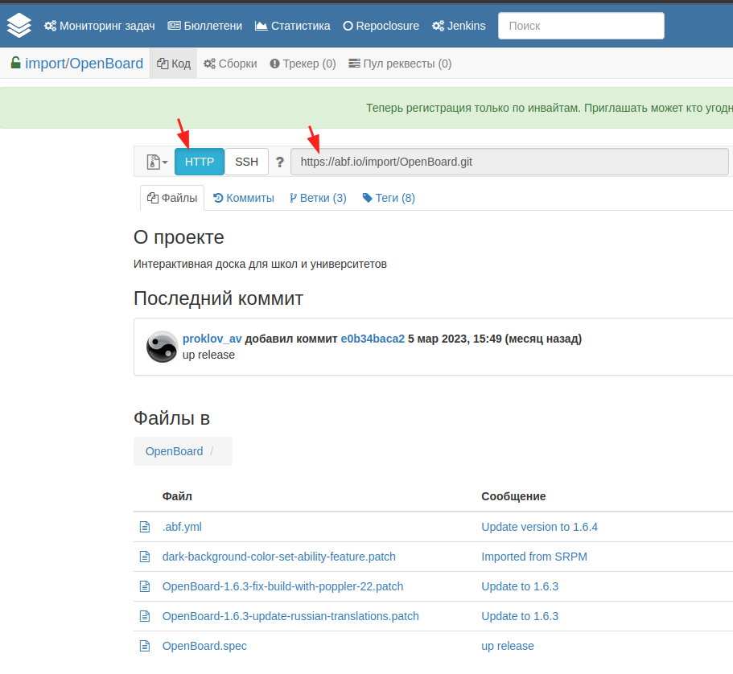
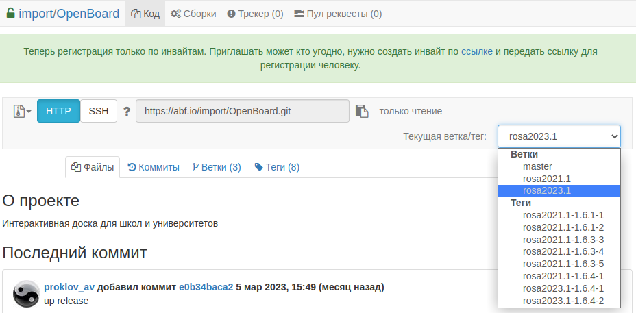

# О сборке и сопровождении пакетов в Росе для знакомых со сборкой RPM

## О Росе

Роса — это самостоятельный дистрибутив GNU/Linux, не основанный ни на одном другом дистрибутиве. Является продолжением развития дистрибутива Mandriva.

Модель обновление — полуроллинг: такие базовые компоненты, как glibc, gcc и др. не обновляются мажорно в рамках платформы (rosa2021.1, rosa2023.1), а пользовательские приложения (chromium, Firefox, Thunderbird, LibreOffice и др.) обновляются. Консерватизм условно средний.

Пакетный менеджер — dnf (до платформы rosa2016.1 включительно использовался унаследованный из Mandriva пакетный менеджер dnf, затем был осуществлен [переход на rpm4](https://nixtux.ru/1052) — смена пакетного менеджера без смены пакетной базы, своя собственная пакетная база продолжила развитие, дистрибутива ROSA не был и не стал колоном Fedora.

Низкоуровневый пакетный менеджер — rpm — той же ветки, что и в большинстве других дистрибутивов (Fedora, RHEL, openSUSE и др.). К стандартным макросам RPM добавляются макросы из [rpm-rosa-setup](https://abf.io/soft/rpm-rosa-setup) — всегда установленного при сборке пакета — и других установленных пакетов с макросами.

После сборки пакеты попадают в репозиторий на abf-downloads.rosalinux.ru:

* для платформы rosa2021.1: https://abf-downloads.rosalinux.ru/rosa2021.1/repository/
* для платформы rosa2023.1: https://abf-downloads.rosalinux.ru/rosa2023.1/repository/

Затем, раз в несколько часов и если не установлено особой отметки не делать этого, происходит синхронизация на основное зеркало:

* для платформы rosa2021.1: https://mirror.rosalinux.ru/rosa/rosa2021.1/repository/
* для платформы rosa2023.1 зеркала пока нет, т.к. платформа находится в активной разработке и не выпущена.

Другие зеркала, например, http://mirror.yandex.ru/rosa синхронизируются с mirror.rosalinux.ru.

## Кратко об ABF

Для сборки пакетов используется среда обеспечения полного жизненного цикла дистрибутива [ABF](https://abf.io). Сайты abf.io и abf.rosalinux.ru являются одним и тем же.

Что делается на ABF:

* git-репозитории с исходными кодами пакетов (они размещены здесь: https://abf.io/import/);
* хранилище https://file-store.rosalinux.ru для хранением тарболлов и прочих исходников (чтобы не хранить большие файлы в git, они закачиваются на file-store, а в файл `.abf.yml` прописывается хеш-суммы файлов, которые при сборке пакета нужно взять с file-store);
* сборка пакетов;
* публикация результатов сборки (в репозитории на abf-downloads.rosalinux.ru);
* сборка ISO-образов, тарболлов rootfs и др. (официальные установочные образы собираются на ABF: https://abf.io/product_build_lists);
* служба https://repoclosure.rosalinux.ru — наглядная визуализация вывода команда `dnf repoclosure` с результами проверки репозиториев на замкнутость зависимостей.

Сборка пакета на ABF происходит примерно следующим образом:

* сборочному агенты (билдеры) от управляющего сервера поступает задание взять такой-то git, из такого-то хеша коммита или ветки, и собрать пакет для такой-то платформы (rosa2021.1, rosa2023.1);
* сборочный агент получает задание и:
	* выкачивает git (abf.io/import/xxx)
	* запускает утилиту [mock](https://github.com/rpm-software-management/mock), которая:
		* создает чистый чрут, т.е. минимальное окружение;
		* устанавливает в него сборочные зависимости;
		* собирает SRPM и RPM с помощью rpmbuild (это часть rpm);
* сборочный агент загружает результаты сборки ­— пакеты SRPM и RPM — на file-store;
* управляющему серверу отдается мета-информация, включая хеши загруженных на file-store пакетов.

Затем система публикации пакетов может положить их в репозиторий, удалив из него пакеты, собранные в предыдущей сборке этого же проекта.

Работать с ABF можно как через веб-интерфейс, так и по [API](https://rosa-abf.github.io), в т.ч. через консольный клиент.

## chroot/контейнер для локальной сборки

Рассмотрим, как быстро сделать контейнер с Росой, чтобы собирать пакеты в отдельном изолированном окружении. В качестве хостовой ОС может быть любой Linux с ядром >= 4.14, в т.ч. сама Роса.

Скачиваем последнюю сборку rootfs для x86_64:

* rosa2021.1: https://abf.io/platforms/rosa2021.1/products/284
* rosa2023.1: https://abf.io/platforms/rosa2023.1/products/408

Для других архитектур см. здесь: https://abf.io/platforms/rosa2021.1/products и https://abf.io/platforms/rosa2023.1/products

Для скачивания нажимаем на номер сборки и затем скачиваем архив из ссылок на результаты сборки.

Допустим, скачан файл `rootfs-std-rosa2021.1_x86_64_2023-04-06.tar.xz`.

Необходима утилита `systemd-nspawn`. В некоторых дистрибутивах, например, rosa2021.1, она входит в пакет systemd, в некоторых (Debian, Ubuntu, ALT) есть отдельный пакет `systemd-container`, который нужно установить на хост.

Теперь нужно распаковать архив и войти в чрут:

```
sudo -i
cd /var/lib/machines
mkdir rosa2021.1
cd rosa2021.1
tar -xf rootfs-std-rosa2021.1_x86_64_2023-04-06.tar.xz
```

Получится файловая система Росы в `/var/lib/machines/rosa2021.1/`. Заходим в шелл:

`sudo systemd-nspawn -D /var/lib/machines/rosa2021.1`.

Можно использовать [snr](https://github.com/mikhailnov/snr) (есть в репозиториях Росы и Альта) для сокращения команды входа до `snr rosa2021.1` и чтобы сразу работала возможность запускать графические программы изнутри контейнера, что удобно для проверки результатов сборки.

Описанные ниже команды можно выполнять в этом шелле.

Здесь и далее через sudo пишутся команды, которые обязательно выполнить с root-правами, не обязательно именно через sudo.

## Сборка пакета локально (без mock)

Во время сборки пакета ABF не делает чего-либо, что нельзя было бы сделать у себя на компьютере без него. Рассмотрим сборку пакета локально через rpmbuild. mock — слой абстракции над rpmbuild — пока что не будем рассматривать.

Вам потребуется либо установленная на железо ОС ROSA, либо виртуальная машина с ней, либо chroot/контейнер.

Установим необходимые пакеты:

`sudo dnf install basesystem-build abf git-core /usr/bin/mbd /usr/bin/spectool createrepo_c`

* basesystem-build ­— мета-пакет, по зависимостям притягивающее пакеты, которые на ABF есть в чруте при сборке каждого пакета (rpm-build, gcc и т.д.);
* abf — сокращение (провайд) abf-console-client — консольного клиента ABF;
* /usr/bin/mbd ([rpm-mk-build-deps](https://abf.io/import/rpm-mk-build-deps)) — простой скрипт, который собирает пакет-заглушку, превращая BuildRequires в RPM-спеке в Requires (зависимости) этого пакета-заглушки; установка такого пакета подтягивает сборочные зависимости, а его удаление автоматически удаляет их как сироты (в dnf хорошо работает механизм удаления сирот (autoremove));
* spectool — утилита для, например, скачивания исходников;
* crearepo_c ­— утилита для создания метаданных репозитория.

Для начала пересоберем какой-нибудь пакет с минимальной правкой — поднятием релиза.

Заходим на https://abf.io/import/OpenBoard и копируем ссылку на клонирование git:



Выполняем: `git clone -b rosa2021.1 https://abf.io/import/OpenBoard.git`

Ветки в git совпадают с названием платформы. В веб-интерфейсе переключение веток справа вверху:



Ветка master не используется.

Переходим в папку со скачанным git: `cd OpenBoard`

Редактируем спек, поднимаем Release. В `git diff` видим правку.

Делаем пакет-заглушку для подтягивания сборочных зависимостей: `mbd *.spec`, ставим его: `sudo dnf in *.rpm`. Можете попробовать сделать `sudo dnf rm OpenBoard-build-deps`, чтобы посмотреть, как все подтянутые им сборочные зависимости удалятся вместе с ним.

Запускаем сборку: `abf rpmbuild`. Это примерно то же самое, что сначала выполнить `abf fetch` для скачивания прописанных в `.abf.yml` исходников с file-store, а затем `rpmbuild --define "_sourcedir $PWD" -bb *.spec` для сборки пакета. При первом запуске abf-клиент попросит задать параметры, можно просто везде нажать Enter, а затем поправить их в `~/.abfcfg` или просто удалить этот файл, чтобы он снова задал вопросы.

Теперь красиво установим собранный пакет, более красиво, чем `sudo dnf install пакет.rpm`. Обычно такая красота излишня, но покажу для примера. После `dbf rpmbuild` результаты сборки лежат прямо в текущей папке. Создадим в ней метаданные репозитория, запустив: `createrepo_c .`  
Теперь запустим обновление системы с подключением этого репозитория:  
`sudo dnf --nogpgcheck --repofrompath x,$PWD upgrade`  
Вместо `upgrade` можно написать, например, `install OpenBoard`.

Поздравляю с первым собранным пакетом! Теперь соберем его через mock:

```
abf rpmbuild -bs
mock *.src.rpm
```

Если запускаете mock не от root, то можно добавить пользователя в группу `mock` (`sudo usermod -a -G mock username`), чтобы не спрашивало пароль.

Через `git clean -fd` можно удалить весь скопившийся мусор (в т.ч. результаты сборки).
